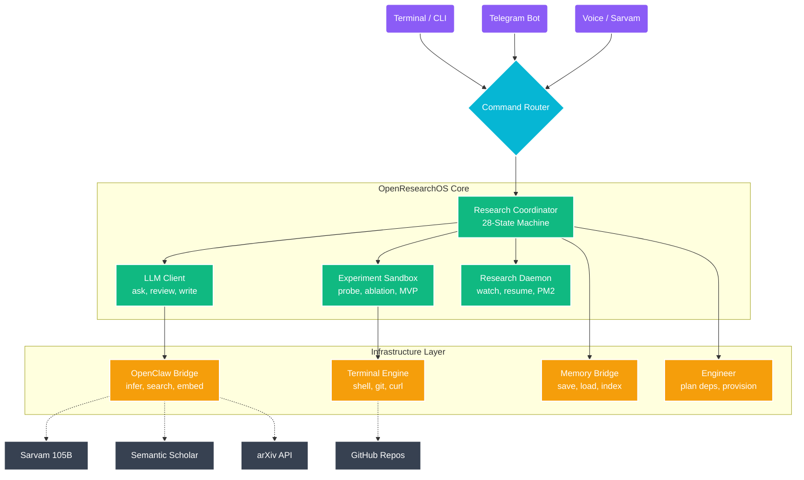

<div align="center">


</div>

```text
                                                                                    
         ╔═══════════════════════════════════════════════════════════════════════════╗
         ║                                                                         ║
         ║     ██████╗ ██████╗ ███████╗███╗   ██╗ ██████╗██╗      █████╗ ██╗    ██╗║
         ║    ██╔═══██╗██╔══██╗██╔════╝████╗  ██║██╔════╝██║     ██╔══██╗██║    ██║║
         ║    ██║   ██║██████╔╝█████╗  ██╔██╗ ██║██║     ██║     ███████║██║ █╗ ██║║
         ║    ██║   ██║██╔═══╝ ██╔══╝  ██║╚██╗██║██║     ██║     ██╔══██║██║███╗██║║
         ║    ╚██████╔╝██║     ███████╗██║ ╚████║╚██████╗███████╗██║  ██║╚███╔███╔╝║
         ║     ╚═════╝ ╚═╝     ╚══════╝╚═╝  ╚═══╝ ╚═════╝╚══════╝╚═╝  ╚═╝ ╚══╝╚══╝ ║
         ║                         L    A    B                                     ║
         ║                                                                         ║
         ╚═══════════════════════════════════════════════════════════════════════════╝

```

<div align="center">

[](#-what-is-openclaw-lab)
[](#-architecture)
[](#-quickstart)
[](#-research-runs)

<br>


</div>

---

## 🧠 What is OpenClaw Lab?

**OpenClaw Lab** is an autonomous research agent that behaves like a serious junior researcher — not a chatbot that generates summaries.

Give it a research topic, and it will:

| Step | What Happens | Time |
|:-----|:-------------|:-----|
| 📋 **Plan** | Generates search queries for recent + foundational papers | ~30s |
| 🔍 **Discover** | Finds 10-15 papers via Semantic Scholar, arXiv, web search | ~2min |
| 📄 **Read** | Downloads PDFs, converts to markdown, extracts claims | ~5min |
| 🗺️ **Map** | Builds a claim graph and identifies research gaps | ~2min |
| 💡 **Ideate** | Generates 20 ideas, clusters them, shortlists top 5 | ~3min |
| ⚔️ **Review** | Simulated reviewer council attacks each idea (5 reviewers) | ~3min |
| 🧪 **Experiment** | Runs micro-probes → probes → ablations → MVP experiments | 5-60min |
| 📝 **Write** | Drafts a paper or writes an honest failure report | ~3min |
| ✅ **Export** | Full trajectory with every tool call, source, and decision | ~10s |

> **The key principle:** If the evidence is weak, the system outputs a *research failure report* instead of pretending it has a paper.

---

## 🏗️ Architecture



---

## 🔬 The Research Pipeline — State Machine

The core of OpenResearchOS is a **28-state research pipeline**. Every research run walks through these states, and the system can resume from any checkpoint if interrupted.

```text
                                 THE RESEARCH STATE MACHINE
                                 
     ╭────────────╮
     │   TOPIC    │   User provides a research question
     │  RECEIVED  │
     ╰─────┬──────╯
           │
           ▼
     ╭────────────╮
     │   TOPIC    │   Classify: local_experiment | remote_compute | theory_only
     │   SCOPED   │
     ╰─────┬──────╯
           │
     ══════╧═══════════════════════════════════════════════════════
     ║           PHASE 1: DISCOVERY & EVIDENCE                   ║
     ══════╤═══════════════════════════════════════════════════════
           │
           ▼
     ╭────────────╮     ╭────────────╮     ╭────────────╮
     │  SEARCH    │────▶│ LITERATURE │────▶│  EVIDENCE  │
     │   PLAN     │     │ DISCOVERY  │     │   LOCKED   │
     ╰────────────╯     ╰────────────╯     ╰─────┬──────╯
                                                  │
     ══════════════════════════════════════════════╧═══════════════
     ║           PHASE 2: READING & MAPPING                       ║
     ══════════════════════════════════════════════╤═══════════════
                                                  │
           ┌──────────────────────────────────────┘
           ▼
     ╭────────────╮     ╭────────────╮     ╭────────────╮     ╭────────────╮
     │  PAPERS    │────▶│   CLAIM    │────▶│  RESEARCH  │────▶│    GAPS    │
     │  PARSED    │     │   GRAPH    │     │    MAP     │     │ IDENTIFIED │
     ╰────────────╯     ╰────────────╯     ╰────────────╯     ╰─────┬──────╯
                                                                     │
     ════════════════════════════════════════════════════════════════╧═══
     ║           PHASE 3: IDEATION & REVIEW                            ║
     ════════════════════════════════════════════════════════════╤══════
                                                                │
           ┌────────────────────────────────────────────────────┘
           ▼
     ╭────────────╮     ╭────────────╮     ╭────────────╮     ╭────────────╮
     │   IDEA     │────▶│  REVIEWER  │────▶│   IDEAS    │────▶│  NOVELTY   │
     │   TREE     │     │  PASS 1    │     │  REVISED   │     │  TRIBUNAL  │
     ╰────────────╯     ╰────────────╯     ╰────────────╯     ╰─────┬──────╯
                                                                     │
                                                                     ▼
                                                               ╭────────────╮
                                                               │   IDEAS    │
                                                               │ SHORTLIST  │
                                                               ╰─────┬──────╯
                                                                     │
     ════════════════════════════════════════════════════════════════╧═══
     ║           PHASE 4: EXPERIMENT LADDER                            ║
     ════════════════════════════════════════════════════════════╤══════
                                                                │
           ┌────────────────────────────────────────────────────┘
           ▼
     ╭────────────╮     ╭────────────╮     ╭────────────╮
     │   HUMAN    │────▶│   MICRO    │────▶│   MICRO    │
     │  APPROVAL  │     │   PROBE    │     │  REVIEWED  │──────┐
     ╰────────────╯     ╰────────────╯     ╰────────────╯      │
                                                                │
           ┌────────────────────────────────────────────────────┘
           ▼
     ╭────────────╮     ╭────────────╮     ╭────────────╮     ╭────────────╮
     │   PROBE    │────▶│  RESULT    │────▶│  REVISION  │────▶│  ABLATION  │
     │ EXPERIMENT │     │  REVIEW    │     │  DECISION  │     │  or MVP    │
     ╰────────────╯     ╰────────────╯     ╰────────────╯     ╰─────┬──────╯
                                                                     │
     ════════════════════════════════════════════════════════════════╧═══
     ║           PHASE 5: OUTPUT                                       ║
     ════════════════════════════════════════════════════════════╤══════
                                                                │
           ┌────────────────────────────────────────────────────┘
           ▼
     ╭────────────╮     ╭────────────╮     ╭────────────╮
     │   PAPER    │────▶│   PAPER    │────▶│   TRACE    │
     │ READINESS  │     │   DRAFT    │     │  EXPORTED  │
     │  REVIEW    │     │ or FAILURE │     │     ✅      │
     ╰────────────╯     ╰────────────╯     ╰────────────╯
```

---

## 🧪 The Experiment Ladder

Not all experiments are equal. OpenClaw Lab uses a **progressive experiment ladder** — cheap tests first, expensive only when warranted:

```text
                    THE EXPERIMENT LADDER
                    
    ╔══════════════════════════════════════════════════╗
    ║                                                  ║
    ║   Level 4:  MVP EXPERIMENT        30-120 min     ║
    ║   ┌──────────────────────────────────────────┐   ║
    ║   │  Full baseline + ablation + metrics      │   ║
    ║   │  Paper-grade evidence                    │   ║
    ║   │  Fixed seeds, plots, logs                │   ║
    ║   └──────────────────────────────────────────┘   ║
    ║                     ▲                            ║
    ║                     │  PROMOTE only if           ║
    ║                     │  results are real           ║
    ║                                                  ║
    ║   Level 3:  ABLATION                10-45 min    ║
    ║   ┌──────────────────────────────────────────┐   ║
    ║   │  Test which component matters            │   ║
    ║   │  Method variants comparison              │   ║
    ║   └──────────────────────────────────────────┘   ║
    ║                     ▲                            ║
    ║                     │                            ║
    ║                                                  ║
    ║   Level 2:  PROBE EXPERIMENT       5-20 min      ║
    ║   ┌──────────────────────────────────────────┐   ║
    ║   │  One baseline, one metric                │   ║
    ║   │  Does this idea deserve more time?       │   ║
    ║   └──────────────────────────────────────────┘   ║
    ║                     ▲                            ║
    ║                     │  KILL or PROMOTE           ║
    ║                                                  ║
    ║   Level 1:  MICRO-PROBE             1-5 min      ║
    ║   ┌──────────────────────────────────────────┐   ║
    ║   │  Synthetic/toy data, quick signal check  │   ║
    ║   │  Is this idea worth investigating?       │   ║
    ║   └──────────────────────────────────────────┘   ║
    ║                     ▲                            ║
    ║                     │                            ║
    ║                  💡 IDEA                          ║
    ║                                                  ║
    ╚══════════════════════════════════════════════════╝
```

After **every** experiment, the system must choose exactly **one** next action:

```text
┌──────────────────────────────────────────────────────────────┐
│  PROMOTE_TO_NEXT_LEVEL  │  ADD_BASELINE    │  ADD_ABLATION  │
│  FIX_BUG_AND_RERUN      │  CHANGE_METRIC   │  CHANGE_DATASET│
│  NARROW_CLAIM            │  KILL_IDEA       │  SEARCH_MORE   │
│  MARK_REMOTE_COMPUTE_NEEDED                                  │
└──────────────────────────────────────────────────────────────┘
```

No experiment can produce only "promising" or "interesting." Every result **must change the next step.**

---

## ⚖️ The Reviewer Council

Every idea is attacked by **5 simulated reviewers** before experiments begin:

```text
                    ╔═══════════════════════════════╗
                    ║       REVIEWER COUNCIL        ║
                    ╠═══════════════════════════════╣
                    ║                               ║
                    ║   👤 Novelty Reviewer          ║
                    ║   "Has this been done before?" ║
                    ║                               ║
                    ║   👤 Experimental Reviewer      ║
                    ║   "Is this testable locally?"  ║
                    ║                               ║
                    ║   👤 Theory Reviewer            ║
                    ║   "Why should this work?"      ║
                    ║                               ║
                    ║   👤 Reproducibility Reviewer   ║
                    ║   "Can anyone rerun this?"     ║
                    ║                               ║
                    ║   👤 Venue Reviewer             ║
                    ║   "Where could this submit?"   ║
                    ║                               ║
                    ╠═══════════════════════════════╣
                    ║  Each reviewer returns:       ║
                    ║  • Score (1-10)               ║
                    ║  • Fatal flaws                ║
                    ║  • Fixable flaws              ║
                    ║  • Required experiments       ║
                    ║  • Accept / Revise / Reject   ║
                    ╚═══════════════════════════════╝
```

The council runs **three times**: once on ideas, once on results, and once on the final paper draft.

---

## 📁 Project Structure

```text
OpenClaw-Lab/
│
├── openresearchos/                    # ← The research operating system
│   ├── src/
│   │   ├── openresearch.mjs           #    Core state machine & CLI (28 states)
│   │   ├── research_daemon.mjs        #    Background daemon with auto-resume
│   │   ├── llm_client.mjs             #    LLM interface (prompts, JSON parsing)
│   │   ├── openclaw_bridge.mjs        #    OpenClaw gateway integration
│   │   ├── experiment_sandbox.mjs     #    Isolated experiment execution
│   │   ├── experiment_codegen.mjs     #    AI-generated experiment code
│   │   ├── engineer.mjs               #    Resource planning & dataset download
│   │   ├── terminal.mjs               #    Shell execution engine
│   │   ├── pdf_reader.mjs             #    PDF → Markdown conversion
│   │   ├── memory_bridge.mjs          #    Persistent memory (failed ideas, lessons)
│   │   ├── telegram_notifier.mjs      #    Rich Telegram milestone updates
│   │   ├── telegram_bot.mjs           #    Telegram bot command handler
│   │   ├── telegram_bridge.mjs        #    Telegram ↔ pipeline bridge
│   │   ├── rate_limiter.mjs           #    Cross-process rate limiting
│   │   ├── semantic_scholar.mjs       #    Semantic Scholar API client
│   │   ├── arxiv_client.mjs           #    arXiv search client
│   │   ├── openclaw_subagents.mjs     #    Parallel specialist agents
│   │   └── llm_safe.mjs              #    Safe LLM output parsing
│   │
│   ├── channels/
│   │   └── command_router.mjs         #    Unified input → pipeline router
│   │
│   ├── scripts/
│   │   └── orchestrate.sh             #    Full pipeline orchestrator
│   │
│   ├── docs/
│   │   ├── OPENRESEARCHOS_HIGH_BAR_PLAN.md   # Master design document
│   │   ├── OPENRESEARCHOS_V2_PLAN.md         # V2 upgrade plan
│   │   ├── MASTER_BUILD_PLAN.md              # Build roadmap
│   │   ├── DEMO_SCRIPT.md                    # Professor demo script
│   │   └── OPENCLAW_INTEGRATION.md           # Integration guide
│   │
│   └── runs/                          #    82 research runs (artifacts)
│       └── run_<id>/
│           ├── run_state.json         #    Checkpoint state
│           ├── evidence/              #    Locked evidence snapshots
│           ├── paper_summaries/       #    Parsed paper extractions
│           ├── experiments/           #    Experiment workspaces
│           ├── paper_draft.md         #    Generated paper (if RRL ≥ 5)
│           └── research_failure_report.md  # Honest failure (if RRL < 5)
│
├── tools/
│   └── sarvam_cli.mjs                 # Sarvam voice API CLI
│
├── docs/
│   └── SARVAM_STACK.md                # Sarvam integration docs
│
├── ecosystem.config.cjs               # PM2 process management
└── start_gateway.sh                   # OpenClaw gateway launcher
```

---

## 🚀 Quickstart

<details>
<summary><b>Prerequisites</b></summary>

| Requirement | Version | Purpose |
|:------------|:--------|:--------|
| **Node.js** | ≥ 24.x | Runtime for all modules |
| **Python** | ≥ 3.11 | Experiment execution |
| **uv** | latest | Fast Python package management |
| **OpenClaw** | latest | Gateway for inference & tools |
| **PM2** | latest | Daemon process management |

</details>

### 1. Clone & Install

```bash
git clone https://github.com/your-username/OpenClaw-Lab.git
cd OpenClaw-Lab
cd openresearchos && npm install && cd ..
```

### 2. Configure Secrets

```bash
mkdir -p ~/.openclaw/secrets
echo "your-sarvam-api-key" > ~/.openclaw/secrets/sarvam-api-key.txt

# Optional: Telegram notifications
echo "your-bot-token" > ~/.openclaw/secrets/telegram-bot-token.txt
echo "your-chat-id"   > ~/.openclaw/secrets/telegram-chat-id.txt
```

### 3. Start the Gateway

```bash
./start_gateway.sh
```

### 4. Run Your First Research

```bash
# Quick demo (offline-safe, ~5 minutes)
cd openresearchos
node src/openresearch.mjs demo --topic "calibration-aware active learning"

# Full pipeline (online, 20-60 minutes)
./scripts/orchestrate.sh "uncertainty estimation for reliable neural networks"
```

### 5. Monitor via Telegram

```text
/start_research calibration-aware active learning for medical imaging
/status run_20260608104616
/approve_micro_probe run_20260608104616 i04
/summarize run_20260608104616
```

---

## 📊 Research Runs

OpenClaw Lab has completed **82 autonomous research runs** across **17 distinct research topics** during June 2026.

<details>
<summary><b>📋 Research Topics Explored (click to expand)</b></summary>

| # | Research Topic | Runs | Status |
|:-:|:---------------|:----:|:------:|
| 1 | Traceable autonomous research agents | 14 | ✅ Paper drafted |
| 2 | Calibration-aware active learning | 8 | ✅ Paper drafted |
| 3 | Agent reliability in healthcare AI | 12 | ✅ Paper drafted |
| 4 | Uncertainty-aware pseudo-label selection | 6 | ✅ Paper drafted |
| 5 | Uncertainty estimation for reliable NNs | 5 | ✅ Paper drafted |
| 6 | Efficient long-context transformers | 4 | 📋 Failure report |
| 7 | Efficient attention mechanisms | 4 | 📋 Failure report |
| 8 | Retrieval-augmented generation | 4 | ✅ Paper drafted |
| 9 | Continual learning & catastrophic forgetting | 3 | 📋 Failure report |
| 10 | Mixture-of-experts routing strategies | 3 | 📋 Failure report |
| 11 | Multimodal foundation models | 3 | 📋 Failure report |
| 12 | Neural architecture search | 3 | 📋 Failure report |
| 13 | Reinforcement learning from human feedback | 3 | 📋 Failure report |
| 14 | Test-time compute scaling for LLMs | 3 | 📋 Failure report |
| 15 | Active learning | 3 | ✅ Paper drafted |
| 16 | Agentic AI research automation | 2 | ✅ Paper drafted |
| 17 | Agent reliability in clinical AI | 2 | ✅ Paper drafted |

> 📋 = The system **honestly reported** that the evidence was insufficient for a paper.  
> ✅ = Paper readiness level ≥ RRL-5, a draft was generated.

</details>

---

## 🛡️ Quality Gates

An idea only advances if it passes these **hard gates** — no shortcuts:

```text
┌──────────────────────────────────────────────────────────────────────┐
│                         QUALITY GATES                                │
│                                                                      │
│  ┌──────────────┐  At least 10 sources reviewed                     │
│  │ EVIDENCE     │  or smaller corpus explicitly justified            │
│  └──────────────┘                                                    │
│  ┌──────────────┐  Source set includes recent + foundational work    │
│  │ FRESHNESS    │                                                    │
│  └──────────────┘                                                    │
│  ┌──────────────┐  System searches for near-identical ideas         │
│  │ PRIOR ART    │                                                    │
│  └──────────────┘                                                    │
│  ┌──────────────┐  Idea has clear difference from existing methods  │
│  │ NOVELTY      │                                                    │
│  └──────────────┘                                                    │
│  ┌──────────────┐  Idea explains WHY it should work                 │
│  │ MECHANISM    │                                                    │
│  └──────────────┘                                                    │
│  ┌──────────────┐  Success metrics defined BEFORE experiments       │
│  │ METRIC       │                                                    │
│  └──────────────┘                                                    │
│  ┌──────────────┐  At least one baseline or ablation planned        │
│  │ BASELINE     │                                                    │
│  └──────────────┘                                                    │
│  ┌──────────────┐  Early local test produces useful signal          │
│  │ MICRO-PROBE  │                                                    │
│  └──────────────┘                                                    │
│  ┌──────────────┐  No fatal reviewer flaw remains                   │
│  │ REVIEWER     │                                                    │
│  └──────────────┘                                                    │
│  ┌──────────────┐  Experiment results produce useful evidence       │
│  │ RESULT       │                                                    │
│  └──────────────┘                                                    │
│  ┌──────────────┐  Final claims link to evidence IDs or exp logs    │
│  │ PAPER        │                                                    │
│  └──────────────┘                                                    │
│                                                                      │
└──────────────────────────────────────────────────────────────────────┘
```

---

## 🗣️ India-First Voice Interface

OpenClaw Lab integrates **Sarvam AI** for a multilingual voice research interface:

```text
                    VOICE RESEARCH FLOW
                    
    🗣️  User speaks          Sarvam STT          OpenClaw
    (Hindi/English/    ──────────────────▶    processes
     code-mixed)           saaras:v3          command
                                                 │
                                                 ▼
                                          Research pipeline
                                          runs the step
                                                 │
                                                 ▼
    🔊  User hears          Sarvam TTS          OpenClaw
    progress summary   ◀──────────────────    summarizes
    in chosen language      bulbul:v3          results

    Supported: hi-IN, bn-IN, ta-IN, te-IN, gu-IN, kn-IN,
               ml-IN, mr-IN, pa-IN, od-IN, en-IN
```

---

## 🧠 Memory System

Failed ideas aren't deleted — they're **saved to memory** so the system learns:

```text
~/.openclaw/workspace/memory/
├── failed_ideas/         # Ideas that failed reviewer or experiment gates
│   ├── attention_pruning_v2.md
│   └── naive_ensemble.md
├── lessons/              # Reusable research lessons
│   └── sarvam_rate_limit_handling.md
└── run_summaries/        # Compressed run outcomes
    └── calibration_run_01.md
```

Before generating new ideas, the system **checks memory** via Jaccard similarity and OpenClaw semantic search to avoid repeating past failures.

---

## 📈 Paper Readiness Levels

```text
    RRL-0  ░░░░░░░░░░  Vague idea
    RRL-1  ██░░░░░░░░  Evidence-backed gap
    RRL-2  ████░░░░░░  Novelty survives prior-art search
    RRL-3  ██████░░░░  Micro-probe completed
    RRL-4  ████████░░  Probe experiment with baseline
    RRL-5  ██████████  MVP with ablation — paper draft generated
```

> **At RRL < 5**, the system writes a `research_failure_report.md` instead of pretending.

---

## 🔧 CLI Commands

```bash
# Pipeline commands
node src/openresearch.mjs start    --topic "your research topic"
node src/openresearch.mjs discover --run <run_id>
node src/openresearch.mjs read     --run <run_id>
node src/openresearch.mjs map      --run <run_id>
node src/openresearch.mjs ideas    --run <run_id>
node src/openresearch.mjs run-experiment --run <run_id> --idea <id> --level micro_probe
node src/openresearch.mjs write    --run <run_id>
node src/openresearch.mjs status   --run <run_id>
node src/openresearch.mjs verify   --run <run_id>

# Quick demo
node src/openresearch.mjs demo --topic "any research topic"

# Full orchestration
./scripts/orchestrate.sh "your research topic"

# Voice tools
node tools/sarvam_cli.mjs tts --text "Hello" --output out.wav
node tools/sarvam_cli.mjs stt --file audio.wav --mode transcribe
```

---

## 🔒 Safety Rules

| Rule | Enforcement |
|:-----|:------------|
| Human approval before experiments | `approval.json` required in experiment dir |
| Untrusted repos inspected, not executed | `engineer.mjs` reads README only |
| Max dataset download: 2 GB | Hard limit in `engineer.mjs` |
| Max experiment runtime: 60 min | Enforced by `terminal.mjs` timeouts |
| Max reruns per idea: 5 | Counter in `experiment_sandbox.mjs` |
| No huge SOTA claims from toy runs | Reviewer council catches overclaims |
| Failed experiments preserved | Never deleted from `runs/` directory |
| Secrets never committed | `.gitignore` excludes all key files |

---

## 🗓️ Development Timeline

```text
    MAY 31 ─────────────────── Sarvam Voice CLI + API integration
         │
    JUN 01 ─────────────────── OpenResearchOS v1: core pipeline, state machine,
         │                     experiment codegen, CLI, first 14 demo runs
         │
    JUN 02 ─────────────────── Evidence layer: Semantic Scholar, arXiv clients,
         │                     memory bridge, terminal engine, Telegram bridge
         │
    JUN 03 ─────────────────── Daemon mode: PM2 management, auto-resume,
         │                     start scripts, background research
         │
    JUN 06 ─────────────────── V2 upgrade: rate limiter, PDF reader (marker),
         │                     parallel subagents, safe LLM parsing
         │
    JUN 07 ─────────────────── Experiment engine: sandbox isolation, engineer
         │                     resource planner, OpenClaw bridge hardening,
         │                     Telegram notifier + bot
         │
    JUN 08 ─────────────────── Research daemon, full pipeline runs,
         │                     82 autonomous runs across 17 topics
         │
    JUN 16 ─────────────────── Daemon state management, bot flags
         │
    JUN 21 ─────────────────── Repository cleanup, documentation, publish
```

---

## 🤝 Contributing

Contributions are welcome! Please:

1. Fork the repository
2. Create a feature branch (`git checkout -b feature/amazing-feature`)
3. Commit your changes (`git commit -m 'Add amazing feature'`)
4. Push to the branch (`git push origin feature/amazing-feature`)
5. Open a Pull Request

---

## 📄 License

This project is licensed under the MIT License — see the [LICENSE](LICENSE) file for details.

---

<div align="center">

```text

    Built with obsession through June 2026
    82 research runs  ·  17 topics  ·  800+ papers read  ·  300+ experiments

    ─────────────────────────────────────────────────────────
    "The agent must not produce a one-shot research idea.
     Every idea must pass through evidence, review, and experiment."
    ─────────────────────────────────────────────────────────

```

<br>

<sub>Made with 🧠 by <b>Mohan Ganesh</b> — Powered by <b>OpenClaw</b> + <b>Sarvam AI</b></sub>

</div>
