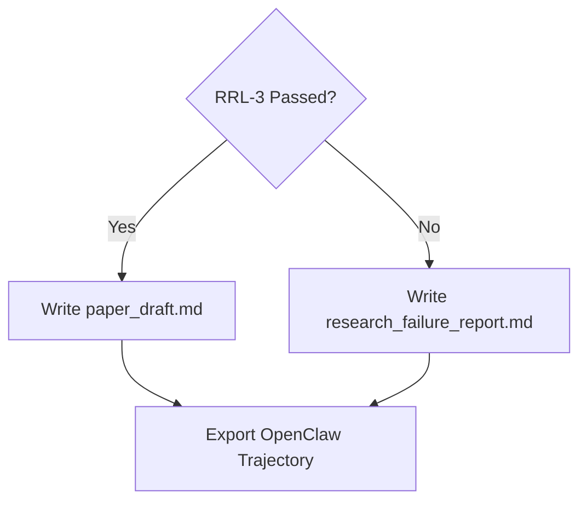

# OpenResearchOS Paper Writer

Use this skill after experiments and reviewer passes. It determines whether to write a paper draft or a research failure report, then exports the full OpenClaw trajectory for traceability.

## The Readiness Gate (RRL-3)



### Paper Draft Prerequisites
- Average reviewer score ≥ 6.0
- No fatal flaws from Novelty, Experimental, or Theory reviewer
- At least one successful baseline-backed experiment
- At least 10 locked evidence sources linked to claims
- Explicit limitations section required

### Failure Report Content
If any gate fails, write `research_failure_report.md` with:
1. Gaps targeted vs ideas generated
2. Reviewer council critique summary
3. Competitor overlap findings (from `openclaw infer web search`)
4. Experiment outcomes and actual metrics
5. Concrete reasons for non-promotion and recovery plan

## Full Write Workflow

### Step 1: Write Final Output
```bash
node src/openresearch.mjs write --run <run_id>
```

This generates:
- `paper_readiness_review.md` — RRL assessment
- `venue_fit.md` — where this could submit (workshop/conference/arXiv)
- `final_report.md` — complete run summary
- `paper_draft.md` OR `research_failure_report.md`

### Step 2: Export OpenClaw Trajectory (MANDATORY)

This is the full auditability record — every search, fetch, reviewer decision, and experiment:

```bash
openclaw sessions export-trajectory \
  --session-key "openresearchos-<run_id>" \
  --output runs/<run_id>/trajectory_export \
  --json
```

The trajectory export is triggered automatically by the `write` command via `openclaw_bridge.mjs`. Verify it exists:
```bash
ls runs/<run_id>/trajectory_export/
cat runs/<run_id>/trace_export_command.md
```

### Step 3: Memory Promotion

After writing, promote key lessons to long-term memory:
```bash
openclaw memory promote --limit 5 --apply
```

### Step 4: Run Status
```bash
node src/openresearch.mjs status --run <run_id>
```

### Step 5: Search and Confirm
Search for the run in memory to confirm persistence:
```bash
openclaw memory search --query "<run_id> <topic>" --json
```

## Venue Fit Guide

| Evidence Level | Venue Target |
|---|---|
| RRL-5, peer-reviewed data, strong ablations | NeurIPS / ICML / ICLR / CVPR main track |
| RRL-4, synthetic + 1 real dataset | Workshop at top-4 venues |
| RRL-3, synthetic only, positive signal | arXiv preprint only |
| Below RRL-3 | Failure report, no submission |

## Required Artifacts Checklist

- [ ] `paper_readiness_review.md`
- [ ] `venue_fit.md`
- [ ] `final_report.md`
- [ ] `paper_draft.md` (only if RRL-3+) OR `research_failure_report.md`
- [ ] `trace_export_command.md` (always)
- [ ] `trajectory_export/` (via `openclaw sessions export-trajectory`)

## Tool Selection Matrix

| Task | OpenClaw Tool |
|---|---|
| Write final output | `exec: node src/openresearch.mjs write --run <run_id>` |
| Export trajectory | `openclaw sessions export-trajectory --session-key "openresearchos-<run_id>"` |
| Promote memory | `openclaw memory promote --apply` |
| Verify memory | `openclaw memory search --query "<topic>"` |
| Read trace command | `exec: cat runs/<run_id>/trace_export_command.md` |
